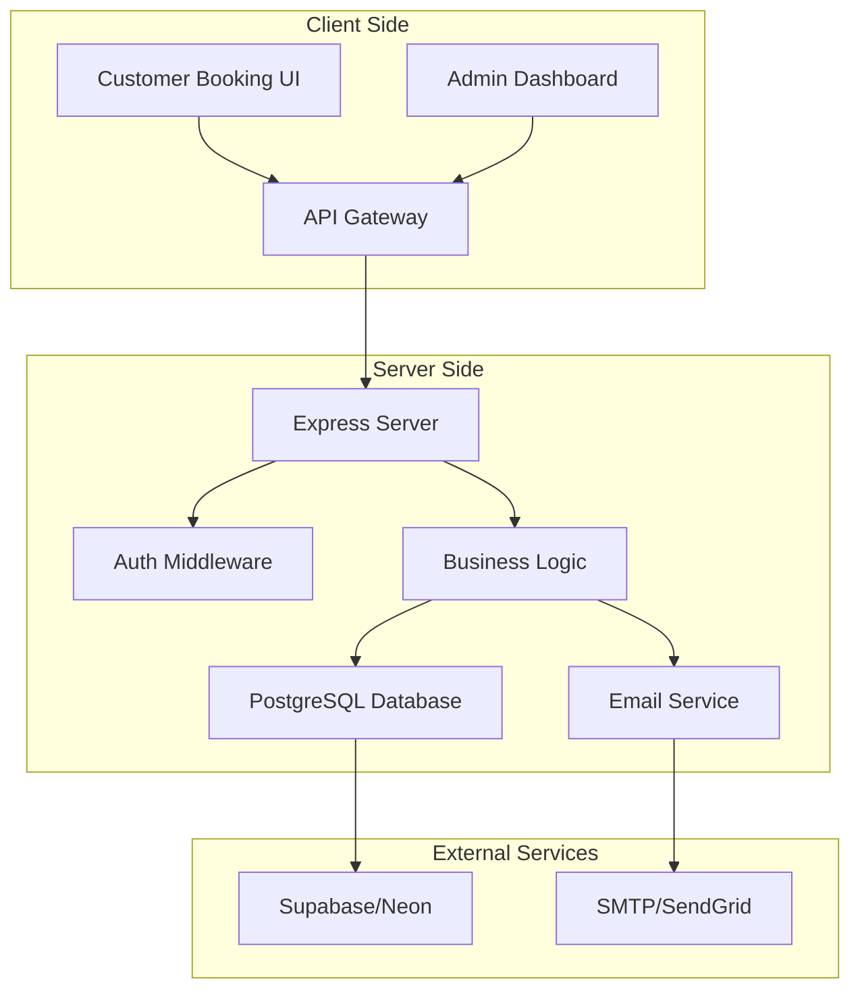

# BeauBook - Beauty Booking System Architecture

## Project Overview

A lightweight MVP booking system for beauty salons with customer-facing booking interface and admin management dashboard.

## Technology Stack

- **Frontend**: React 18 with TypeScript
- **Backend**: Node.js with Express.js
- **Database**: PostgreSQL (hosted on Supabase/Neon)
- **Authentication**: JWT for admin auth
- **Styling**: Tailwind CSS
- **State Management**: React Context API
- **Email Service**: Nodemailer with Gmail/SendGrid
- **Deployment**:
  - Backend: Render or Railway
  - Frontend: Vercel or Netlify
  - Database: Supabase or Neon (free tier)

## System Architecture



## Database Schema

### Tables Structure

#### 1. admins

- id (UUID, PRIMARY KEY)
- email (VARCHAR, UNIQUE, NOT NULL)
- password_hash (VARCHAR, NOT NULL)
- name (VARCHAR, NOT NULL)
- role (VARCHAR, DEFAULT 'admin')
- created_at (TIMESTAMP)
- updated_at (TIMESTAMP)

#### 2. staff

- id (UUID, PRIMARY KEY)
- name (VARCHAR, NOT NULL)
- email (VARCHAR, UNIQUE)
- phone (VARCHAR)
- specialties (TEXT[]) - array of service IDs
- avatar_url (VARCHAR)
- is_active (BOOLEAN, DEFAULT true)
- created_at (TIMESTAMP)
- updated_at (TIMESTAMP)

#### 3. services

- id (UUID, PRIMARY KEY)
- name (VARCHAR, NOT NULL)
- description (TEXT)
- duration_minutes (INTEGER, NOT NULL)
- price (DECIMAL(10,2), NOT NULL)
- category (VARCHAR)
- is_active (BOOLEAN, DEFAULT true)
- created_at (TIMESTAMP)
- updated_at (TIMESTAMP)

#### 4. staff_schedules

- id (UUID, PRIMARY KEY)
- staff_id (UUID, FOREIGN KEY -> staff.id)
- day_of_week (INTEGER, 0-6)
- start_time (TIME, NOT NULL)
- end_time (TIME, NOT NULL)
- is_active (BOOLEAN, DEFAULT true)
- created_at (TIMESTAMP)
- updated_at (TIMESTAMP)

#### 5. staff_breaks

- id (UUID, PRIMARY KEY)
- staff_id (UUID, FOREIGN KEY -> staff.id)
- day_of_week (INTEGER, 0-6)
- start_time (TIME, NOT NULL)
- end_time (TIME, NOT NULL)
- created_at (TIMESTAMP)

#### 6. bookings

- id (UUID, PRIMARY KEY)
- booking_ref (VARCHAR, UNIQUE) - e.g., "BK-20240301-001"
- customer_name (VARCHAR, NOT NULL)
- customer_email (VARCHAR, NOT NULL)
- customer_phone (VARCHAR, NOT NULL)
- staff_id (UUID, FOREIGN KEY -> staff.id)
- service_id (UUID, FOREIGN KEY -> services.id)
- booking_date (DATE, NOT NULL)
- start_time (TIME, NOT NULL)
- end_time (TIME, NOT NULL)
- status (VARCHAR, DEFAULT 'confirmed') - confirmed, cancelled, completed, no-show
- notes (TEXT)
- created_at (TIMESTAMP)
- updated_at (TIMESTAMP)

#### 7. business_settings

- id (UUID, PRIMARY KEY)
- business_name (VARCHAR, NOT NULL)
- business_address (TEXT)
- business_phone (VARCHAR)
- business_email (VARCHAR)
- opening_time (TIME)
- closing_time (TIME)
- booking_buffer_minutes (INTEGER, DEFAULT 15)
- max_advance_booking_days (INTEGER, DEFAULT 30)
- timezone (VARCHAR, DEFAULT 'America/Vancouver')
- created_at (TIMESTAMP)
- updated_at (TIMESTAMP)

### Database Indexes

- bookings: (booking_date, staff_id) - for availability queries
- bookings: (customer_email) - for customer lookup
- bookings: (status, booking_date) - for admin queries
- staff_schedules: (staff_id, day_of_week) - for schedule queries

## API Endpoints

### Public Endpoints (No Auth Required)

#### Booking Flow

- `GET /api/business/info` - Get business information
- `GET /api/services` - List all active services
- `GET /api/staff` - List all active staff members
- `GET /api/staff/:staffId/services` - Get services for specific staff
- `POST /api/availability` - Get available time slots
  - Body: { staffId, serviceId, date }
- `POST /api/bookings` - Create new booking
  - Body: { customerName, customerEmail, customerPhone, staffId, serviceId, date, startTime, notes }
- `GET /api/bookings/:bookingRef` - Get booking details by reference

### Admin Endpoints (Auth Required)

#### Authentication

- `POST /api/admin/login` - Admin login
- `POST /api/admin/logout` - Admin logout
- `GET /api/admin/profile` - Get admin profile
- `POST /api/admin/refresh-token` - Refresh JWT token

#### Staff Management

- `GET /api/admin/staff` - List all staff
- `POST /api/admin/staff` - Create new staff member
- `PUT /api/admin/staff/:id` - Update staff member
- `DELETE /api/admin/staff/:id` - Soft delete staff member
- `GET /api/admin/staff/:id/schedule` - Get staff schedule
- `PUT /api/admin/staff/:id/schedule` - Update staff schedule

#### Service Management

- `GET /api/admin/services` - List all services
- `POST /api/admin/services` - Create new service
- `PUT /api/admin/services/:id` - Update service
- `DELETE /api/admin/services/:id` - Soft delete service

#### Booking Management

- `GET /api/admin/bookings` - List all bookings with filters
- `PUT /api/admin/bookings/:id` - Update booking status
- `GET /api/admin/bookings/stats` - Get booking statistics

#### Business Settings

- `GET /api/admin/settings` - Get business settings
- `PUT /api/admin/settings` - Update business settings

## Frontend Components Structure

### Customer Booking Interface

```
/booking
  ├── components/
  │   ├── ServiceSelector.tsx
  │   ├── StaffSelector.tsx
  │   ├── CalendarView.tsx
  │   ├── TimeSlotPicker.tsx
  │   ├── BookingForm.tsx
  │   └── BookingConfirmation.tsx
  ├── hooks/
  │   ├── useAvailability.ts
  │   └── useBooking.ts
  └── pages/
      ├── BookingPage.tsx
      └── ConfirmationPage.tsx
```

### Admin Dashboard

```
/admin
  ├── components/
  │   ├── Layout/
  │   │   ├── Sidebar.tsx
  │   │   └── Header.tsx
  │   ├── Staff/
  │   │   ├── StaffList.tsx
  │   │   ├── StaffForm.tsx
  │   │   └── ScheduleEditor.tsx
  │   ├── Services/
  │   │   ├── ServiceList.tsx
  │   │   └── ServiceForm.tsx
  │   ├── Bookings/
  │   │   ├── BookingCalendar.tsx
  │   │   └── BookingList.tsx
  │   └── Settings/
  │       └── BusinessSettings.tsx
  ├── hooks/
  │   ├── useAuth.ts
  │   └── useAdmin.ts
  └── pages/
      ├── LoginPage.tsx
      ├── DashboardPage.tsx
      ├── StaffPage.tsx
      ├── ServicesPage.tsx
      └── BookingsPage.tsx
```

## Security Considerations

1. **Authentication**

   - JWT tokens with short expiry (15 min) and refresh tokens
   - Bcrypt for password hashing
   - Rate limiting on login attempts

2. **Data Validation**

   - Input sanitization on all endpoints
   - SQL injection prevention via parameterized queries
   - XSS prevention via React's built-in escaping

3. **CORS Configuration**

   - Whitelist frontend domains only
   - Credentials included for admin routes

4. **Environment Variables**
   ```
   DATABASE_URL=
   JWT_SECRET=
   JWT_REFRESH_SECRET=
   EMAIL_HOST=
   EMAIL_PORT=
   EMAIL_USER=
   EMAIL_PASS=
   FRONTEND_URL=
   ```

## Deployment Strategy

### Backend (Render/Railway)

1. Build command: `npm run build`
2. Start command: `npm start`
3. Environment variables configuration
4. Health check endpoint: `/api/health`

### Frontend (Vercel/Netlify)

1. Build command: `npm run build`
2. Publish directory: `dist` or `build`
3. Environment variables for API URL
4. Redirects configuration for SPA

### Database (Supabase/Neon)

1. Connection pooling enabled
2. SSL required
3. Automatic backups
4. Read replicas for scaling (future)

## MVP Features Priority

### Phase 1 - Core Booking (Week 1)

- [x] Database setup
- [x] Basic API structure
- [x] Service listing
- [x] Staff listing
- [x] Availability calculation
- [x] Booking creation

### Phase 2 - Admin Functions (Week 2)

- [x] Admin authentication
- [x] Staff management
- [x] Schedule management
- [x] Service management
- [x] Booking view

### Phase 3 - Polish & Deploy (Week 3)

- [x] Email confirmations
- [x] UI/UX improvements
- [x] Error handling
- [x] Testing
- [x] Deployment

## Performance Optimizations

1. **Database**

   - Indexed queries for availability checks
   - Connection pooling
   - Query result caching for services/staff

2. **Frontend**

   - React.memo for expensive components
   - Lazy loading for admin routes
   - Optimistic UI updates

3. **API**
   - Response compression
   - Rate limiting
   - Redis caching (future enhancement)

## Future Enhancements

1. **Features**

   - Customer accounts and booking history
   - SMS notifications
   - Online payments
   - Recurring appointments
   - Waitlist management
   - Multi-location support

2. **Technical**
   - WebSocket for real-time updates
   - GraphQL API
   - Mobile app
   - Analytics dashboard
   - A/B testing framework

## Success Metrics

1. **Performance**

   - Page load time < 2s
   - API response time < 200ms
   - 99.9% uptime

2. **Business**
   - Booking conversion rate
   - Admin task completion time
   - Customer satisfaction score

## Development Workflow

1. **Local Development**

   ```bash
   # Backend
   cd backend
   npm install
   npm run dev

   # Frontend
   cd frontend
   npm install
   npm run dev
   ```

2. **Testing**

   - Unit tests for business logic
   - Integration tests for API
   - E2E tests for critical flows

3. **CI/CD**
   - GitHub Actions for automated testing
   - Automatic deployment on main branch
